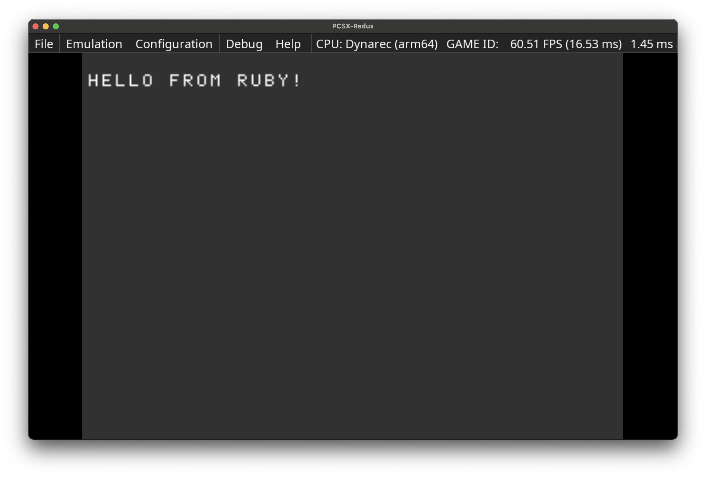

# Ruby for PlayStation

This is a port of mruby/c for PlayStation 1.



## Building

Run `make` in the root directory of this repository.'

```sh
$ cd ruby && make
```

## Running

Use PS1 emulator to run the built ps-exe file.

### Prerequisites

- MIPS C compiler
- PS1 emulator or a real PS1 console